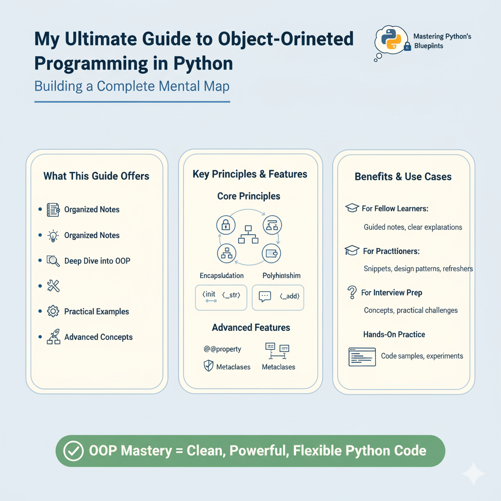
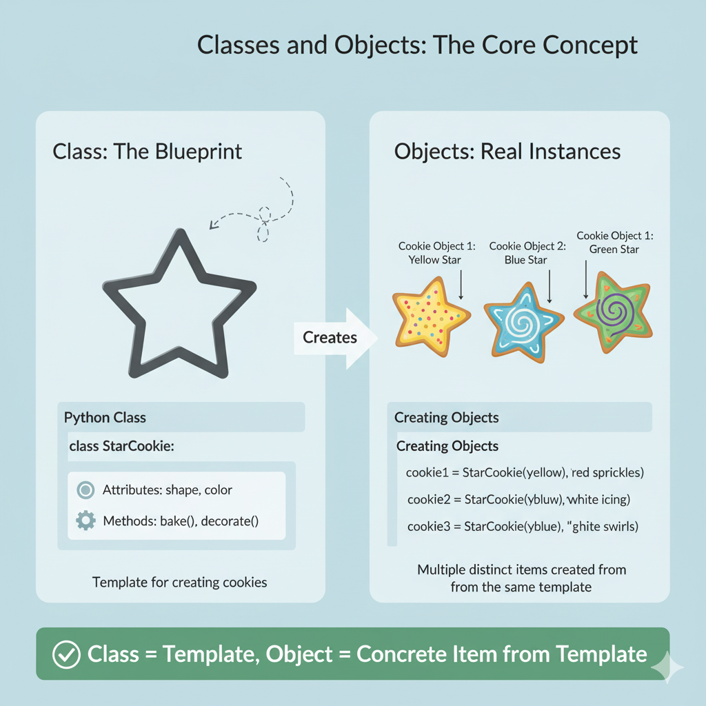
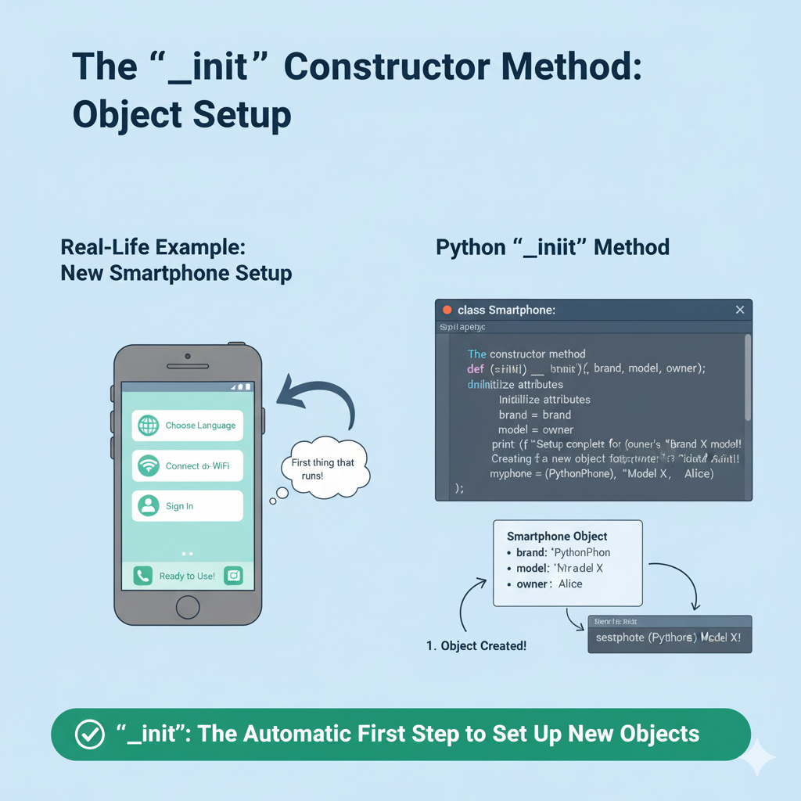
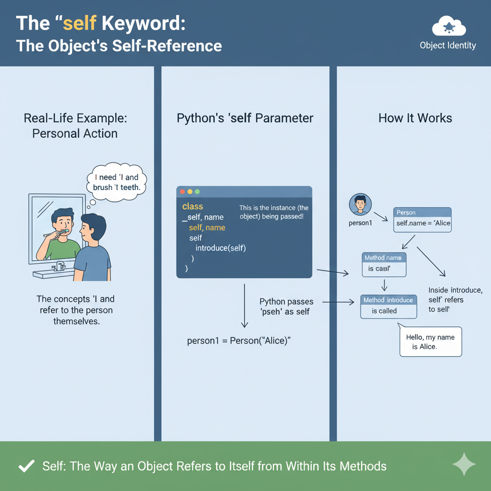
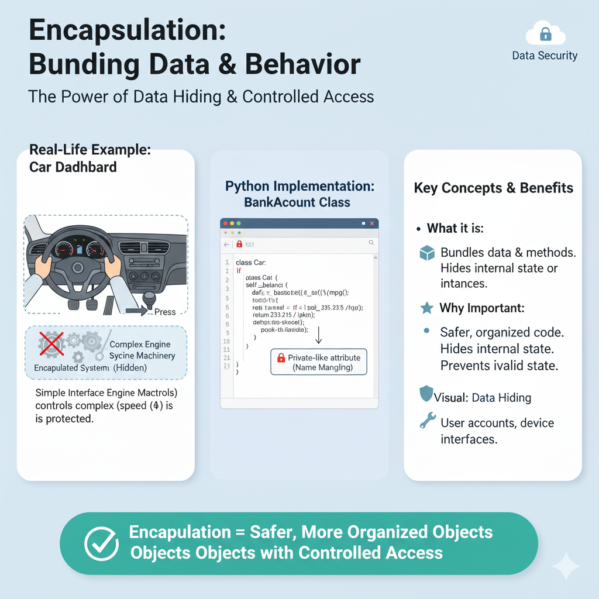
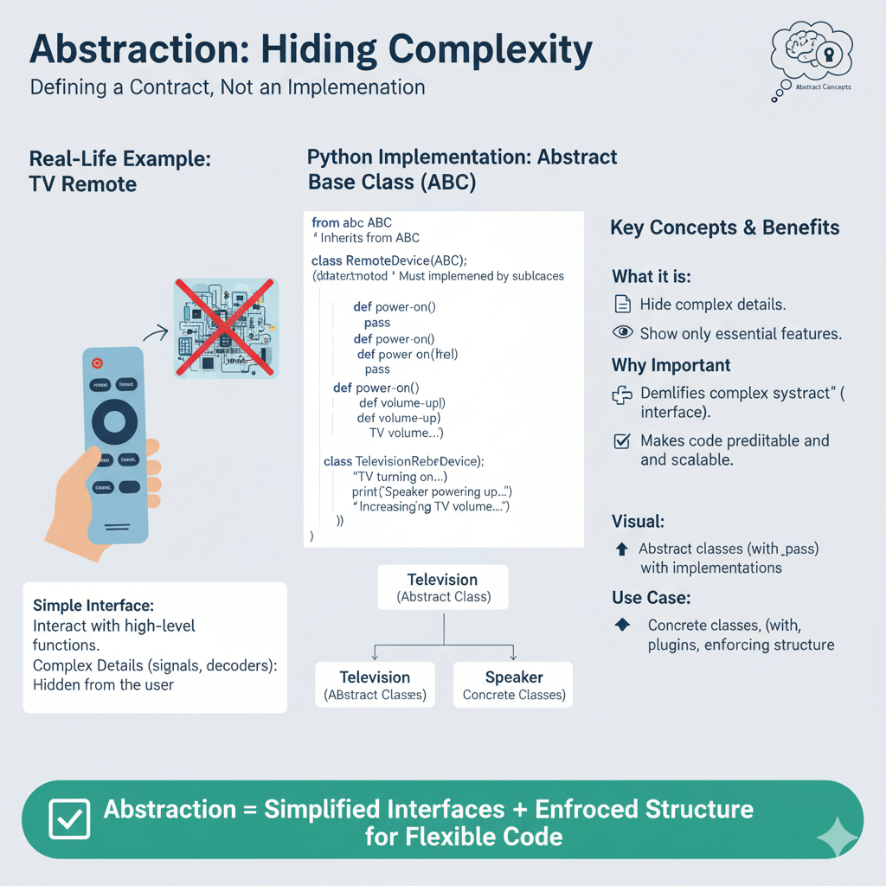
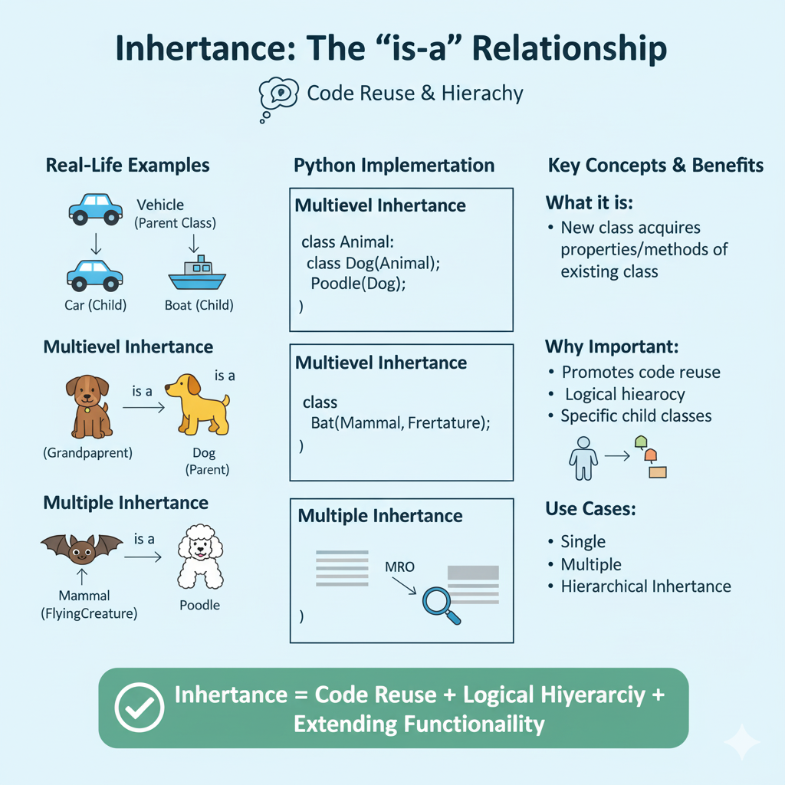
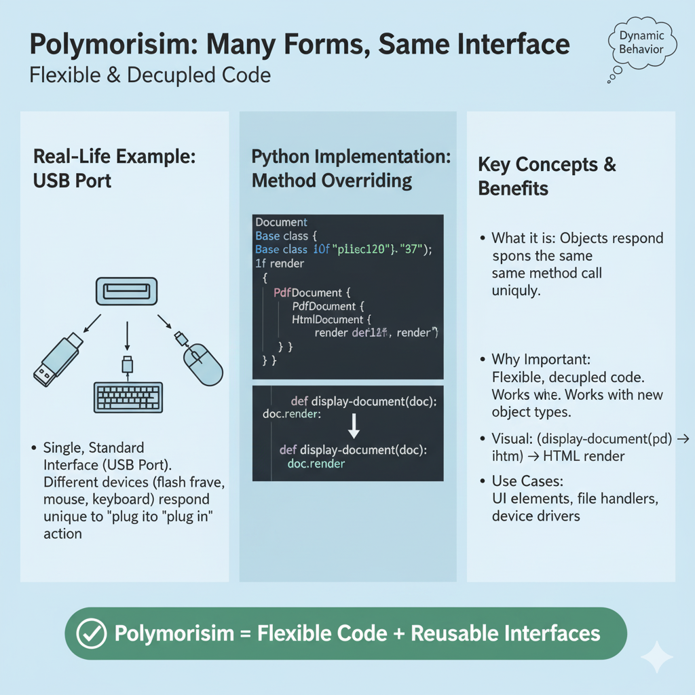

# My Ultimate Guide to Object-Oriented Programming in Python



Hello! My initial journey into Python's classes and objects was just the tip of the iceberg. I realized that to truly master Python, I needed to understand every facet of its Object-Oriented Programming (OOP) capabilities. So, I've created this document as my personal, exhaustive reference guide. I've broken down every topic, from the simplest idea to the most complex, in a way that I can understand and come back to whenever I need a refresher.

This is my attempt to build a complete mental map of Python OOP.

---

### Table of Contents

* [🔹 Basics of OOP in Python](#basics-of-oop)
    * [Classes and Objects](#classes-and-objects)
    * [`__init__` constructor method](#init-constructor)
    * [`self` keyword](#self-keyword)
    * [Class vs. Instance Variables](#class-vs-instance-variables)
    * [Class Methods (`@classmethod`)](#class-methods)
    * [Static Methods (`@staticmethod`)](#static-methods)
* [🔹 Core OOP Principles](#core-principles)
    * [Encapsulation](#encapsulation)
    * [Abstraction](#abstraction)
    * [Inheritance](#inheritance)
    * [Polymorphism](#polymorphism)
* [🔹 Special (Dunder/Magic) Methods](#dunder-methods)
    * [`__str__` vs `__repr__`](#str-vs-repr)
    * [Container Methods](#container-methods)
    * [Iterator Methods](#iterator-methods)
    * [`__call__` (Callable Objects)](#callable-objects)
    * [Operator Overloading](#operator-overloading)
    * [`__new__` and `__del__`](#new-and-del)
* [🔹 Advanced Class Features](#advanced-features)
    * [Properties (`@property`, setters, deleters)](#properties)
    * [Data Hiding & Name Mangling](#data-hiding)
    * [Abstract Base Classes (ABC module)](#abc)
    * [Composition vs. Inheritance](#composition-vs-inheritance)
* [🔹 Object Lifecycle & Memory](#object-lifecycle)
    * [Shallow Copy vs. Deep Copy](#shallow-vs-deep-copy)
    * [Garbage Collection in Python](#garbage-collection)
* [🔹 OOP + Python Specifics](#python-specifics)
    * [Metaclasses](#metaclasses)
    * [Duck Typing](#duck-typing)
    * [Monkey Patching](#monkey-patching)
    * [`functools.singledispatch`](#singledispatch)

---

## 🔹 Basics of OOP in Python
<a name="basics-of-oop"></a>

This is where it all begins. Getting these fundamentals right is the key to everything else.

### Classes and Objects
<a name="classes-and-objects"></a>

* **What it is:** This is the absolute core concept.
    * A **Class** is a **blueprint** or a recipe. It's a template that defines a new type of thing. It describes the properties (attributes) and behaviors (methods) that all things of this type will share.
    * An **Object** is a real, concrete **instance** created from that blueprint.
* **A Real-Life Example:** I think of a cookie cutter as the **Class**. It defines the shape of all cookies (e.g., a star). The actual cookies I make using that cutter are the **Objects**. Each cookie is a distinct object, but they all share the shape defined by the class.



* **How I use it:**

    ```python
    # This is the blueprint (the Class)
    class Car:
        # The __init__ method sets up the initial properties
        def __init__(self, color, model):
            self.color = color
            self.model = model

    # These are the actual instances (the Objects)
    my_car = Car("Red", "Tesla Model S")
    your_car = Car("Blue", "Ford Mustang")

    print(f"I have a {my_car.color} {my_car.model}.")
    ```

### `__init__` constructor method
<a name="init-constructor"></a>

* **What it is:** The `__init__` method is a special "dunder" (double underscore) method known as the **constructor**.
* **Why it's important:** It's the first thing that runs automatically the moment a new object is created. Its job is to set up the object, giving it its initial state and attributes.
* **A Real-Life Example:** When I get a new smartphone, the first thing I do is go through the setup process: choosing a language, connecting to Wi-Fi, signing into my account. That setup process is exactly like the `__init__` method for my new phone object.



* **How I use it:**

    ```python
    class Dog:
        # The constructor initializes each new Dog object
        def __init__(self, name, breed):
            # These are the attributes being set
            self.name = name
            self.breed = breed
            print(f"Setup complete! A new {self.breed} named {self.name} is born!")

    # This line triggers the __init__ method automatically
    my_dog = Dog("Fido", "Golden Retriever") # Prints the message
    ```

### `self` keyword
<a name="self-keyword"></a>

* **What it is:** `self` is a special parameter that always represents the **instance of the class** that the method is being called on.
* **Why it's important:** It's how methods access the object's own attributes and other methods. When I call `my_dog.bark()`, Python passes the `my_dog` object into the `bark` method as the `self` argument behind the scenes.
* **A Real-Life Example:** When I think to myself, "*I* need to brush *my* teeth," the concept of "I" and "my" refers to me, the specific person (object). `self` is exactly that—it's how the object refers to itself.




* **How I use it:**

    ```python
    class Person:
        def __init__(self, name):
            self.name = name # 'self' refers to the new Person object

        def introduce(self):
            # 'self' gives this method access to the 'name' attribute
            print(f"Hello, my name is {self.name}.")

    person1 = Person("Alice")
    # When I call introduce(), 'self' inside the method is 'person1'
    person1.introduce() # Output: Hello, my name is Alice.
    ```

### Class vs. Instance Variables
<a name="class-vs-instance-variables"></a>

* **What it is:** A crucial distinction about where data is stored.
    * **Instance Variables:** Belong to a specific object. Each object gets its own separate copy. They are defined inside `__init__` with `self.`.
    * **Class Variables:** Are shared by *all* objects of the class. There is only one copy of this variable for the entire class.
* **Why it's important:** I use class variables for data that is the same for all instances, like constants or shared counters. I use instance variables for data that is unique to each object.
* **A Real-Life Example:** If I have a `Human` class, `name` and `age` would be **instance variables** (everyone has their own). But `species = "Homo sapiens"` would be a **class variable** (it's the same for all humans).


* **How I use it:**

    ```python
    class UniversityStudent:
        # Class variable: shared by all students
        university_name = "Tech University"

        def __init__(self, name, student_id):
            # Instance variables: unique to each student
            self.name = name
            self.student_id = student_id

    student1 = UniversityStudent("Alice", "123")
    student2 = UniversityStudent("Bob", "456")

    print(f"{student1.name} attends {student1.university_name}") # Tech University
    print(f"{student2.name} also attends {student2.university_name}") # Tech University
    ```

### Class Methods (`@classmethod`)
<a name="class-methods"></a>

* **What it is:** A method that is bound to the class, not the instance. It's marked with the `@classmethod` decorator and receives the class itself as the first argument, conventionally named `cls`.
* **Why it's important:** They are often used as "alternative constructors" or "factory methods." They let me create instances of my class in different ways.
* **A Real-Life Example:** Imagine a pizza restaurant (the `Pizza` class). The standard way to make a pizza is with `__init__(self, toppings)`. But they might have a special offer, a "Pizza of the Day". A `@classmethod` called `pizza_of_the_day(cls)` would be a factory that knows today's special toppings and creates a `Pizza` object for me.


* **How I use it:**

    ```python
    class Book:
        def __init__(self, title, author):
            self.title = title
            self.author = author

        @classmethod
        def from_string(cls, book_string):
            # A factory that creates a Book object from a hyphenated string
            title, author = book_string.split('-')
            # 'cls' is the Book class itself
            return cls(title, author)

    classic_book = Book("1984", "George Orwell")
    string_book = Book.from_string("The Hobbit-J.R.R. Tolkien")
    print(string_book.title) # The Hobbit
    ```

### Static Methods (`@staticmethod`)
<a name="static-methods"></a>

* **What it is:** A method that doesn't know anything about the class or the instance. It's marked with `@staticmethod` and doesn't receive `self` or `cls`.
* **Why it's important:** It's essentially a regular function that I place inside a class because it's logically related to it. It's a way to group utility functions with their corresponding class.
* **A Real-Life Example:** Imagine a `Car` class. A function to convert miles per gallon to kilometers per liter is related to cars, but it doesn't need to know the color or model of a specific car (`self`), or even the general `Car` blueprint (`cls`). It's just a utility.


* **How I use it:**

    ```python
    class TemperatureConverter:
        @staticmethod
        def celsius_to_fahrenheit(c):
            return (c * 9/5) + 32

        @staticmethod
        def fahrenheit_to_celsius(f):
            return (f - 32) * 5/9

    # I don't need to create an object to use these
    print(TemperatureConverter.celsius_to_fahrenheit(25)) # 77.0
    ```

---

## 🔹 Core OOP Principles
<a name="core-principles"></a>

These are the four pillars that define what OOP is and make it so powerful.

### Encapsulation
<a name="encapsulation"></a>

* **What it is:** The principle of bundling data (attributes) and the methods that operate on that data into a single, self-contained unit (the object). It also involves protecting that data from outside interference, a concept called **data hiding**.
* **Why it's important:** It makes my code safer and more organized. The object is responsible for its own state. It prevents me or other programmers from accidentally setting an attribute to an invalid value.
* **A Real-Life Example:** A car's dashboard is a perfect example. It encapsulates all the car's complex machinery. I interact with a simple interface (steering wheel, pedals, speedometer). I can't directly manipulate the engine's fuel injectors; I press the accelerator, and the car's internal logic handles the rest. Getters and setters are my pedals and speedometer.



* **How I use it:**

    ```python
    class BankAccount:
        def __init__(self, initial_balance):
            # This is "private" due to the double underscore
            if initial_balance >= 0:
                self.__balance = initial_balance
            else:
                self.__balance = 0

        # This is a "getter" method
        def get_balance(self):
            return self.__balance

        # This is a "setter" method
        def deposit(self, amount):
            if amount > 0:
                self.__balance += amount
                print(f"Deposited ${amount}.")
            else:
                print("Deposit amount must be positive.")
    
    my_account = BankAccount(100)
    # print(my_account.__balance) # This will cause an AttributeError
    print(f"Current balance: ${my_account.get_balance()}")
    my_account.deposit(50)
    print(f"New balance: ${my_account.get_balance()}")
    ```

### Abstraction
<a name="abstraction"></a>

* **What it is:** The principle of hiding complex implementation details and showing only the essential features to the user. It's about dealing with ideas rather than events.
* **Why it's important:** It simplifies complex systems. It allows me to define a "contract" that other classes must follow, making my code more predictable and scalable.
* **A Real-Life Example:** When I use a TV remote, I just see buttons like "Power," "Volume Up," etc. This is an abstraction. The complex reality of infrared signals, decoders, and electronics is hidden from me. I only need to know the simple interface.



* **How I use it:** In Python, this is formally achieved with **Abstract Base Classes (ABCs)**, which I'll detail in the advanced section. The core idea is to define *what* a set of classes should be able to do, without dictating *how* they do it.

### Inheritance
<a name="inheritance"></a>

* **What it is:** The mechanism that allows a new class (the child or subclass) to acquire the properties and methods of an existing class (the parent or superclass). It represents an "is-a" relationship.
* **Why it's important:** It promotes code reuse and creates a logical hierarchy. I can write general code in a parent class and then create more specific child classes that add or change functionality without rewriting the original code.



* **A Real-Life Example & How:**
    * **Single Inheritance:** `class ElectricCar(Car):`. An electric car *is a* car, with the added property of a battery.
    * **Multiple Inheritance:** `class Bat(Mammal, FlyingCreature):`. A bat *is a* mammal AND *is a* flying creature. Python's Method Resolution Order (MRO) helps figure out which parent's method to use if they both have one with the same name.
    * **Multilevel Inheritance:** `class Poodle(Dog):` and `class Dog(Animal):`. A poodle *is a* dog, which *is an* animal.
    * **Hierarchical Inheritance:** `class Car(Vehicle):` and `class Boat(Vehicle):`. Both a car and a boat *are* vehicles.

    ```python
    # Multilevel Inheritance Example
    class Animal:
        def eat(self):
            print("This animal is eating.")

    class Dog(Animal): # Dog inherits from Animal
        def bark(self):
            print("This dog is barking.")

    class Poodle(Dog): # Poodle inherits from Dog
        pass

    my_poodle = Poodle()
    my_poodle.eat()  # Inherited from Animal
    my_poodle.bark() # Inherited from Dog
    ```

### Polymorphism
<a name="polymorphism"></a>

* **What it is:** From Greek, meaning "many forms." It's the ability of different objects to respond to the same method call in their own, unique ways.
* **Why it's important:** It makes my code incredibly flexible and decoupled. I can write functions that operate on a general type of object, and they will work correctly even with new types of objects I haven't even thought of yet, as long as those new objects follow the expected interface.
* **A Real-Life Example:** Think of a USB port. It's a single, standard interface. I can plug in a flash drive, a mouse, or a keyboard. Each device responds to being "plugged in" in its own way, but the port itself doesn't need to know the specific details. The port is my generic function, and the devices are my polymorphic objects.



* **How I use it:** The most common form is **Method Overriding**.

    ```python
    class Document:
        def render(self):
            print("Rendering a generic document.")

    class PdfDocument(Document):
        def render(self): # Overriding the parent's method
            print("Rendering a PDF document with high fidelity.")

    class HtmlDocument(Document):
        def render(self): # Overriding the parent's method
            print("Rendering an HTML document for the web.")

    # This function is polymorphic. It works with any object that has a .render() method.
    def display_document(doc):
        print("---Preparing to display---")
        doc.render()

    pdf = PdfDocument()
    html = HtmlDocument()

    display_document(pdf)  # Calls PdfDocument's render method
    display_document(html) # Calls HtmlDocument's render method
    ```

---

## 🔹 Special (Dunder/Magic) Methods
<a name="dunder-methods"></a>

These are special methods with double underscores. I don't call them directly. Instead, Python's syntax triggers them. They're how I make my custom objects feel like native Python types.

* **<a name="str-vs-repr"></a>`__str__` vs `__repr__`**:
    * `__str__`: For a readable, user-friendly string. Called by `print()` and `str()`. The goal is to be pretty.
    * `__repr__`: For an unambiguous, developer-focused string. Called by just typing the object's name in the console. The goal is that `eval(repr(obj)) == obj`. It's the fallback if `__str__` is missing.
* **<a name="container-methods"></a>Container Methods (`__len__`, `__getitem__`, etc.)**: Implementing these lets my object act like a list or dictionary (`len(obj)`, `obj[key]`).
* **<a name="iterator-methods"></a>Iterator Methods (`__iter__`, `__next__`)**: Implementing these lets my object be used in a `for` loop.
* **<a name="callable-objects"></a>`__call__`**: Lets me call an *instance* of my class as if it were a function: `my_object()`.
* **<a name="operator-overloading"></a>Operator Overloading (`__add__`, `__eq__`, etc.)**: Lets me define what operators like `+`, `==`, `<` mean for my objects.
* **<a name="new-and-del"></a>`__new__` and `__del__`**: `__new__` is the first step in object creation; it *creates* the blank object. `__init__` then *initializes* it. `__new__` is rarely used. `__del__` is a destructor, called when an object is garbage collected, but its timing is not guaranteed, so it's best to avoid it for critical cleanup.

    ```python
    class Vector:
        def __init__(self, x, y):
            self.x = x
            self.y = y

        def __repr__(self):
            return f"Vector({self.x}, {self.y})" # For developers

        def __str__(self):
            return f"Vector at ({self.x}, {self.y})" # For users

        def __add__(self, other):
            return Vector(self.x + other.x, self.y + other.y) # Overloads '+'

    v1 = Vector(2, 3)
    v2 = Vector(5, 7)
    v3 = v1 + v2

    print(v3)       # Uses __str__
    print(repr(v3)) # Uses __repr__
    ```

---

## 🔹 Advanced Class Features
<a name="advanced-features"></a>

### Properties (`@property`, setters, deleters)
<a name="properties"></a>

* **What it is:** The "Pythonic" way to manage attributes. The `@property` decorator turns a method into a read-only attribute. I can then define optional `@name.setter` and `@name.deleter` methods to control what happens when someone tries to change or delete the attribute.
* **Why it's important:** It gives me the power of encapsulation (I can add validation logic) with the simple syntax of attribute access. I can start with a simple public attribute and later change it to a property without breaking any code that uses my class.
* **A Real-Life Example:** Think of a thermostat's temperature display. It looks like a simple attribute (`thermostat.temperature`). But in reality, reading it (`@property`) involves a method that checks a sensor. Setting it (`@fullname.setter`) involves a method that turns on the heater or AC.
* **How I use it:**

    ```python
    class Person:
        def __init__(self, name):
            self._name = name # A "protected" attribute by convention

        @property
        def name(self):
            print("Getter called...")
            return self._name

        @name.setter
        def name(self, value):
            print("Setter called...")
            if not isinstance(value, str) or value.strip() == "":
                raise ValueError("Name must be a non-empty string.")
            self._name = value

    p = Person("Alice")
    print(p.name) # Calls the getter
    p.name = "Bob" # Calls the setter
    # p.name = "" # This would raise a ValueError
    ```

### Data Hiding & Name Mangling
<a name="data-hiding"></a>

* **What it is:** Python doesn't have true "private" variables like some other languages. However, if I prefix an attribute with two underscores (e.g., `__balance`), Python performs **name mangling**.
* **Why it's important:** It's a signal to other developers that an attribute is for internal use. The name mangling (`_ClassName__balance`) makes it difficult to accidentally access or overwrite from outside the class, which is especially useful in inheritance to prevent child classes from clobbering a parent's internal attribute.
* **How I use it:** I use this for attributes that are critical to the internal state of my object and should not be touched directly.

### Abstract Base Classes (ABC module)
<a name="abc"></a>

* **What it is:** An ABC is a special type of class that you cannot create an object from. Its purpose is to define a common interface (a set of methods) that all its subclasses must implement.
* **Why it's important:** It's how I formally implement Abstraction. It provides a way to enforce a "contract." If a class claims to be a `Shape`, my ABC can guarantee that it has an `.area()` method.
* **How I use it:**

    ```python
    from abc import ABC, abstractmethod

    class Shape(ABC): # Inherit from ABC
        @abstractmethod # Mark a method as required
        def area(self):
            pass

    class Square(Shape):
        def __init__(self, side):
            self.side = side
        
        # I MUST implement this, or I'll get a TypeError
        def area(self):
            return self.side ** 2

    # my_shape = Shape() # This would raise a TypeError
    my_square = Square(5)
    print(my_square.area()) # 25
    ```

### Composition vs. Inheritance
<a name="composition-vs-inheritance"></a>

* **What it is:** This is a fundamental design decision.
    * **Inheritance** represents an **"is-a"** relationship (a `Poodle` *is a* `Dog`).
    * **Composition** represents a **"has-a"** relationship (a `Car` *has an* `Engine`).
* **Why it's important:** New programmers often overuse inheritance. The rule of thumb is to **favor composition over inheritance**. Composition is more flexible. It's easier to change the "parts" of an object at runtime than to change its fundamental identity (its parent class).
* **A Real-Life Example:** To build a computer, I don't create a new `ComputerThatHasAGraphicsCard` class that inherits from a `Computer` class. I use composition: my `Computer` object *has a* `GraphicsCard` object, a `CPU` object, and a `Memory` object as attributes.
* **How I use it:**

    ```python
    # Composition Example
    class Engine:
        def start(self):
            print("Vroom!")

    class Car:
        def __init__(self, engine_type):
            self.engine = engine_type # The Car 'has an' Engine object

    my_engine = Engine()
    my_car = Car(my_engine)
    my_car.engine.start() # Vroom!
    ```

---

## 🔹 Object Lifecycle & Memory
<a name="object-lifecycle"></a>

### Shallow Copy vs. Deep Copy
<a name="shallow-vs-deep-copy"></a>

* **What it is:** From the `copy` module, two ways to duplicate an object.
    * **Shallow Copy (`copy.copy()`):** Creates a new container object but fills it with *references* to the original object's contents.
    * **Deep Copy (`copy.deepcopy()`):** Creates a new container and *recursively* copies every single object inside, creating a fully independent clone.
* **Why it's important:** If I have an object that contains other mutable objects (like a list of lists) and I use a shallow copy, changing the inner list in the copy will *also change it in the original*. This can cause very confusing bugs.
* **A Real-Life Example:** I have a binder of documents. A **shallow copy** is like getting a new binder and filling it with photocopies of just the table of contents—the entries still point to the original documents. A **deep copy** is getting a new binder and photocopying every single page of every document.
* **How I use it:**

    ```python
    import copy
    
    list_a = [1, [2, 3]]
    
    # Shallow copy
    list_b = copy.copy(list_a)
    list_b[1][0] = 99 # Modify the inner list
    print(f"Original after shallow copy: {list_a}") # [1, [99, 3]] - The original is changed!
    
    # Deep copy
    list_c = copy.deepcopy(list_a)
    list_c[1][0] = 100 # Modify the inner list
    print(f"Original after deep copy: {list_a}") # [1, [99, 3]] - The original is safe!
    ```

### Garbage Collection in Python
<a name="garbage-collection"></a>

* **What it is:** Python's automatic memory management system.
* **How it works:** Its main mechanism is **reference counting**. Every object keeps track of how many variables are pointing to it. When that count drops to zero, the memory is freed. To handle tricky situations called **reference cycles** (where objects refer to each other in a loop), Python also has a secondary **cyclic garbage collector** that runs periodically to find and clean up these isolated loops.
* **Why it's important:** It means I don't have to manually manage memory like in languages like C++, which prevents a whole class of bugs called memory leaks.

---

## 🔹 OOP + Python Specifics
<a name="python-specifics"></a>

These are concepts that highlight Python's dynamic and powerful nature.

### Metaclasses
<a name="metaclasses"></a>

* **What it is:** This is a very advanced topic. In Python, classes are themselves objects. A metaclass is the **"class of a class"**. The default metaclass that Python uses to create all classes is `type`.
* **Why it's important (in rare cases):** I can create my own metaclass to intercept the creation of a class and automatically modify it. This is useful in creating large frameworks or APIs where I need to enforce complex patterns across many classes, like automatically registering new classes in a central registry.
* **A Real-Life Example:** A metaclass is like a factory that builds other factories. It doesn't build the final product (the object); it builds the blueprint-maker (the class). It's a level of abstraction most projects never need.

### Duck Typing
<a name="duck-typing"></a>

* **What it is:** The classic phrase is: "If it walks like a duck and it quacks like a duck, then it must be a duck." In programming, this means Python doesn't care about an object's *type*, only its *behavior* (the methods it has).
* **Why it's important:** This is the core of Python's polymorphism and flexibility. I can write a function that works with any object, as long as that object provides the methods or attributes the function expects.
* **A Real-Life Example:** I ask someone to "write a story." I don't care if they are a `Novelist`, `Poet`, or `Journalist` (their class). As long as they have a `.write()` method, they can fulfill the request.

### Monkey Patching
<a name="monkey-patching"></a>

* **What it is:** Python is so dynamic that I can change classes and even modules at runtime. I can add or replace methods and attributes on the fly. This is called monkey patching.
* **Why it's important:** It can be very useful for testing (e.g., replacing a function that makes a network request with a fake one) or for applying a critical bug fix to a library without waiting for a new release. However, it's a powerful tool that can make code extremely confusing and hard to debug if overused.
* **A Real-Life Example:** It's like being able to swap out the engine of a car while it's driving down the highway. It's risky and not standard practice, but sometimes it's the only way to fix a specific problem on the go.

### `functools.singledispatch`
<a name="singledispatch"></a>

* **What it is:** A decorator that turns a regular function into a **generic function**, which is a function that can have different implementations depending on the type of its first argument.
* **Why it's important:** It's a clean and elegant way to implement method overloading. It lets me avoid messy `if/elif/else` chains that check the type of an argument.
* **How I use it:**

    ```python
    from functools import singledispatch

    @singledispatch
    def format_data(data):
        return f"Generic format: {str(data)}"

    @format_data.register(int)
    def _(data):
        return f"Integer formatted as hex: {hex(data)}"

    @format_data.register(list)
    def _(data):
        return f"List formatted with items: {', '.join(map(str, data))}"

    print(format_data("hello")) # Generic format: hello
    print(format_data(255))     # Integer formatted as hex: 0xff
    print(format_data([1, 2, 3])) # List formatted with items: 1, 2, 3
    ```
